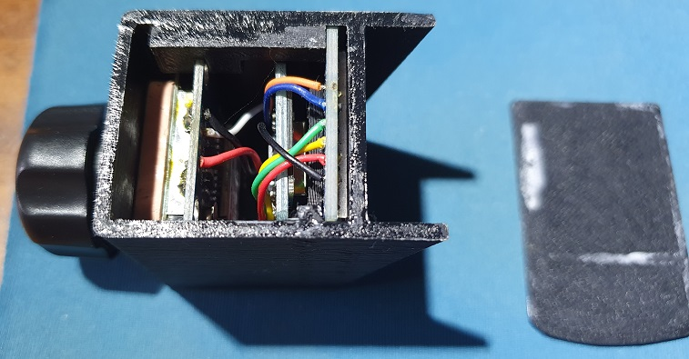

[](http://www.youtube.com/watch?v=BD_0WykSXBo "GPS Speedometer")

# GPS Speedometer
GPS-Speedometer is a nice gadget that shows speed and direction.
It determines speed and direction using GPS module.

## Parts
| Qty | Product | Description       |
| --- | ---- |-------------------|
|1 | [Wemos D1 mini](https://www.aliexpress.com/item/1005004005586872.html?spm=a2g0o.productlist.0.0.4ae71669SXML6q&algo_pvid=0821fd5a-4f47-46a8-bcb5-d30c0906a16d&aem_p4p_detail=2023010207345816669983124667600018896206&algo_exp_id=0821fd5a-4f47-46a8-bcb5-d30c0906a16d-0&pdp_ext_f=%7B%22sku_id%22%3A%2212000027716323745%22%7D&pdp_npi=2%40dis%21ILS%217.34%215.86%21%21%21%21%21%40211b88ee16726736989256168e4f3c%2112000027716323745%21sea&curPageLogUid=36Rr90QFroNm&ad_pvid=2023010207345816669983124667600018896206_1&ad_pvid=2023010207345816669983124667600018896206_1) | Main board        |
|1 | [NEO-6M](https://www.aliexpress.com/item/1005004841512460.html?spm=a2g0o.productlist.0.0.2594445aswmzig&algo_pvid=b33cb520-3a9d-4bf8-912c-267642bdb7c4&aem_p4p_detail=20230102073557551633464332720022106990&algo_exp_id=b33cb520-3a9d-4bf8-912c-267642bdb7c4-0&pdp_ext_f=%7B%22sku_id%22%3A%2212000030702350513%22%7D&pdp_npi=2%40dis%21ILS%218.02%218.02%21%21%215.5%21%21%4021038eda16726737570055516e97c5%2112000030702350513%21sea&curPageLogUid=SZugziWyTBNm&ad_pvid=20230102073557551633464332720022106990_1&ad_pvid=20230102073557551633464332720022106990_1) | GPS Module        |
|1 | [ST7789](https://www.aliexpress.com/item/1005003760323160.html?spm=a2g0o.productlist.0.0.490cb5f5pWcWkc&algo_pvid=1b3a7a0a-383e-4d03-acd4-43efb3131e72&algo_exp_id=1b3a7a0a-383e-4d03-acd4-43efb3131e72-7&pdp_ext_f=%7B%22sku_id%22%3A%2212000027073447132%22%7D&pdp_npi=2%40dis%21ILS%2116.83%2112.62%21%21%215.25%21%21%4021038edc16726738167615018e86a3%2112000027073447132%21sea&curPageLogUid=6wQvREhoFQRY) | LCD Screen Module |

## Notes
[TFT_eSPI by Bodmer](https://github.com/Bodmer/TFT_eSPI) must be installed.
TFT_eSPI config:
1. In User_Setup_Select.h file, select:
```
#include <User_Setups/Setup24_ST7789.h>
```
2. In User_Setups/Setup24_ST7789.h file, must be:
```
#define TFT_CS   -1      // Define as not used
#define TFT_DC   PIN_D2  // Data Command control pin
#define TFT_RST  PIN_D4  // TFT reset pin (could connect to NodeMCU RST, see next line)
```  

[TinyGPS](https://github.com/mikalhart/TinyGPS) must be installed.
* Tested with TinyGPS 13.

[EspSoftwareSerial](https://github.com/plerup/espsoftwareserial) must be installed.

## Connection Diagram


## Assembled
